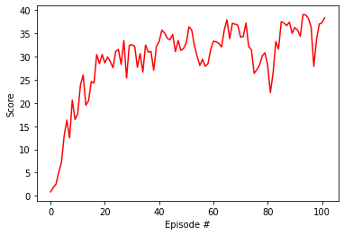

# Project 1: Continuous Control
## Learning Algorithm
This project uses a Deep Deterministic Policy Gradient (DDPG) to solve an environment with a continuous action Space
### DDPG
Deep Deterministic Policy Gradient (DDPG) was first intruduced in [this paper](https://arxiv.org/abs/1509.02971)
It is a generalization of Deep Q learning to a continuous action space.  In Deep Q (DQ) learning, a network takes in a state and predicts the Q value for each possible action.  This is impossible for a continuous action space.  Instead DDPG uses two networks an actor and a critic.  The critic is similar to the Q network from DQ learning, except instead of just taking the state as input it takes in a state and an action and predicts a Q value.  The actor network takes in a state and predicts the best action to take.

The algoritm works a follows:

    1. Initialize local network, and target network (copying the weights from the local network) for both the Actor and the Critic
    2. Initialize a replay buffer
    For each episode do:
        3. initialize environment
        for each timestep do:
            4. Choose an action for the current state using the Actor network.  Since the actor network is deterministic noise is added to make the agent explore
            (The original paper used Ornstein–Uhlenbeck noise, however my implementation uses gaussian noise)
            5. Take the action and observe the next state and reward
            6. Store the State, Action, reward, next state in the replay buffer
            7.  Every N timesteps, if there are enough experiences in the replay buffer then train the target networks M times:
                8. Select a random mini batch of experiences from the replay buffer
                Train the Critic
                    9. Select actions to take in the next state using the target Actor network
                    10. Set the expected Q value to the reward + the discount rate  * the Q value (from the target Critic network) for the next action and the next state
                    11. Step the local Critic network optimizer to bring the Q value closer to the expected Q value
                Train the Actor:
                    12. Predict the Best action to take in the current state using the local Actor network
                    13. Use a loss function of the negative of the predicted Q value for the action from the local Critic network
                    14. Step the local Actor network optimizer to minimize the loss
                16. Every N steps perform a soft update to bring the Target network weights closer to the local network weights
                16. Decrease the size of the added noise
                

### Network Architecture
The Actor network used here is:
State Input
Batch Normalization
256 Fully Connected units
Batch Normalization
Relu Activation
128 Fully Connected units
Batch Normalization
Relu Activation
Action Size Fully Connected units with Hyperbolic Tangent Activation

The Critic network used here is:
State Input
Batch Normalization
256 Fully Connected units
Batch Normalization
Leaky Relu Activation
Concatenate with Action Input
128 Fully Connected units
Batch Normalization
Leaky Relu Relu Activation
1 Linear Node

### Hyperparameters
I use the Following hyperparameters:
update_every=20: Number of timesteps before the agent learns (N in step 7 above)
learn_n_times=10: Number of times to train the networks (M in step 7 above)
noise_scale=0.2:  The initaal Standard Deviation of the added gaussian noise
noise_decay=0.9999: Each time the Agent learns it multiplies the noise scale by this
lr_actor = 1e-3: The learning Rate for the Actor network
lr_critic = 1e-3: The learning Rate for the Critic Network
BUFFER_SIZE = int(1e6):  The replay buffer size
BATCH_SIZE = 128: The training minibatch size
GAMMA = 0.99: The reward discount factor
TAU = 1e-3: For the soft update of target parameters
WEIGHT_DECAY = 0: L2 weight decay for the Critic Network

### Results
This agent was able to solve the envronment in 102 epsodes with an average score of 30.09
Below is a plot of the score for each episode

### Future Work
There are several ways to extend this project.  The first is to use prioritized experience replay, which places greater weight on experiences with a larger difference between the target Q and expected Q.  The next is to train the agent on the crawler environment which is more challenging.  Another is to implement another learning algorithm such as A3C or PPO.